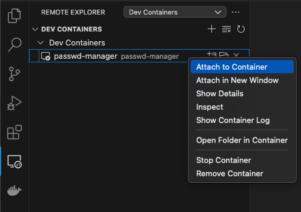
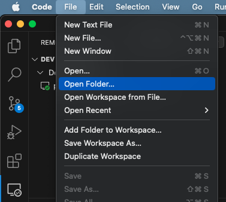

# passwd-manager
this is a simple system that keeps your passwords **secure** and **flexible**

## Get ready
First you need to install cmake.
<!--For ubuntu:
```sh 
sudo apt install cmake
```-->
clone this repo and execute in the project directory
```sh
cmake -Bbuild
cmake --build build
```
the executable should be under build/pman

# Development environment

In order to ensure that all developers use the same environment, we use docker. This will avoid many problems with different versions of libraries and compilers. We will carry out the development using VSCode's `Remote Development` extension. This will allow us to do all our coding, compiling and testing inside a docker container.

## How to set up the development environment

1. Install docker
2. Install VSCode's `Remote Development` extension pack: `ms-vscode-remote.vscode-remote-extensionpack`
3. Build and run the container image with:
```sh
$ cd <passwd-manager root folder>

$ docker build -t passwd-manager . --build-arg USERNAME=`whoami`

$ docker run --name passwd-manager -h passwd-manager-container -v <passwd-manager root folder>:/home/`whoami`/passwd-manager -it passwd-manager
```

## How to run and debug the code
We need to install `CMake`: `twxs.cmake` and `CMake Tools`: `ms-vscode.cmake-tools` in VSCode. Then follow this tutorial: https://code.visualstudio.com/docs/cpp/cmake-linux. This setup will allow us to run the code as well as debug it with the all the features that VSCode offers (breakpoints, step by step, highlight current instruction, etc.)

4. Open the `Remote Explorer` tab in VSCode:

5. Select the folder `/home/$your_username/passwd-manager`:


## Functionality
### Basics
the system just encrypts a file with a password.

the data is loaded on a blockchain that is made out of data blocks.
Each block contains some bytes of data that wants to be encrypted.
These bytes are added with a hash that is derived from the password.
And this sum got a third byte block with salt that is derived from the previous block.

The sum mod 256 for each byte is the encrypted data of this block.
To get all encrypted data, the encrypted bytes of each block are concatenated.

The length of one block depends on the length of bytes that the hash function is returning. You can use *sha256*, *sha384* and *sha512*.

### How to get the hash that is derived from the password?

there are two important measurements:
1. The time it takes to generate the hash has to be *low* for good and fast access
2. The time it takes to generate the hash has to be *high* for good security

Thats why it is important to balance this time.

TODO (how exactly does the algorithm work)

### How to get the salt
the salt is a random generated byte string that is encrypted in the file.
you need to have access to the password hash to decrypt the salt.

The salt is used for the first block as described under *basics*.

For the second block, the salt of the previous block is added to the result
of an *hashchain* that is executed on the passwordhash.
The result is the new salt.

A *hashchain* is a function that calculates the hash of its input.
This hash is hashed again (you can add some salt each step).
This continues for a specific amount of iterations.

### How to decrypt

TODO


## Workflow diagrams:
### Decrypt workflow

 
### Encrypt workflow
 
