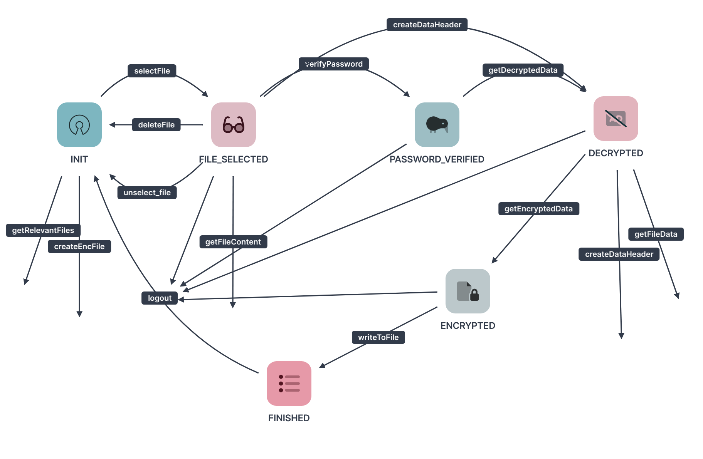

# API CLASS
## Related
### Docs
- [General](/docs/doc.md)
- [File data](file_data.md)
- [DataHeader](dataheader.md)
### Classes
- [API](/include/api.h)

API class is used to interact with the architecture of the software.

Top-Layer applications that are using the software should only interact with the api class.

## State Chart
Every API object starts in the `INIT` state

## Working with the API
1. **construct an `API` object with the file mode that you wanna work with**
    1. see [file data](file_data.md#file-data-modes-list) for more information
  

1. **get the path to the `.enc` file that you wanna work with**

    *the api has some functionality for these actions*
    1. get the current working directory (`getCurrentDirPath()`)
    1. get the default directory where the .enc files are stored (in the user's home directory) (`getEncDirPath()`)
    1. get the names of all .enc files in a given directory (`getAllEncFileNames()`)
    1. get the names of all relevant (that means that they match with the file data mode + a valid header or are empty) .enc files in a given directory (`getRelevantFileNames()`)
  

1. **select the file you wanna work with**
    1. simply use `selectFile(filePath)` 
        - this changes the state from `INIT` to `FILE_SELECTED`
    1. you can unselect a file after selecting it with `unselectFile()`
        - this changes the state from `FILE_SELECTED` to `INIT`
    1. it is also possible to delete a selected file from the system with `deleteFile()`
        - this changes the state from `FILE_SELECTED` to `INIT`
  

1. **what should be done with the selected file**
    1. optional options:
        1. its possible to get the file contents:
            1. get the complete content of the file (`getFileContent()`)
            1. get the data header from the content you got (`getDataHeader()`)
            1. get the encrypted data from the content you got (`getData()`)
        1. there is also a method to check whether the file is empty (`isFileEmpty()`)
          
    1. if the file is empty (`isFileEmpty()`) you have to create a new dataheader for this file (`createDataHeader()`)
        1. you provide a master password for this file
        1. you provide settings for the dataheader (see [dataheader](dataheader.md#dataheadersettings) for more information)
        1. for `DataHeaderSettingsIters` you can also use a timeout (see [dataheader](dataheader.md#dataheadersettings) for more information)
        - this changes the state from `FILE_SELECTED` to `DECRYPTED`
      

    1. if the file is not empty you have to verify the password of the file (`verifyPassword()`)
        1. you provide the master password for that file
        1. the password will be checked with the chainhash of the dataheader (see [dataheader](dataheader.md#how-does-the-data-header-work) for more information)
        1. the checking could take a very long time, you can provide a `timeout` (in ms) for this action (`recommended`)
        1. if the password is correct the password hash will be saved in the API object
        - this changes the state from `FILE_SELECTED` to `PASSWORD_VERIFIED`
  

1. **decrypt the data**
    
    *if you created a new dataheader in `4.2.` you can skip this step*
    1. decrypt the data with `getDecryptedData()`
        1. if the password was not successfully verified in `4.3.` this method will fail
        - this changes the state from `PASSWORD_VERIFIED` to `DECRYPTED`
  

1. **create the `FileData` object**
    1. you can get the `FileDataStruct` from the `getDecryptedData()` or from `getFileData()` if you are in the `DECRYPTED` state
    1. create the `FileData` that belongs to the file mode you gave the constructor (see [file_data.md](file_data.md#where-did-i-use-the-file-data-mode) for more information)
    1. you can now work with the `FileData` object to change internal data or to get the data in a special format
    1. in the end you can get the `FileDataStruct` from the `FileData` object with `getFileData()`
  

1. **[OPTIONAL] change the encryption**
    
    *there are two possible options*
    1. only change the salt (`changeSalt()`)
        - it will just change (randomize) the salt that is used for encryption, that means that the password (-hash) will be the same
        - it is very fast
        - the encrypted result will look completely different (except the dataheader)
        - it can confuse attackers, but it is safer to change the encryption completely
        - see [dataheader](dataheader.md#how-does-the-data-header-work) for more information about the encryption
    1. create a new dataheader with `createDataHeader()`
        - you can get the settings object from the old dataheader (by calling `DataHeader::getSettings()`)
        - to create a new dataheader, compute power and time is needed (see [dataheader](dataheader.md#how-does-the-data-header-work) for more information)
        - **NOTE that the new dataheader + password will be used for the next encryption**
    
        **THE OLD PASSWORD IS NOT LONGER VALID**

1. **encrypt the data**
    1. encrypt the data with `getEncryptedData()`
        1. you have to provide the decrypted data (`FileDataStruct`)
        - this changes the state from `DECRYPTED` to `ENCRYPTED`
  

1. **write to file**
    1. you can write to an empty file with (`writeToFile(file_path)`)
        - this changes the state from `ENCRYPTED` to `FINISHED`
    1. you can write to the selected file with (`writeToFile()`)
        - this changes the state from `ENCRYPTED` to `FINISHED`
  

1. **logout**
    - call `logout()` in any state to delete user information from this `API` object (does the same as destructor + constructor again)
    - it takes the `FModes` argument that you would give the constructor
    - if you wanna use the same `FModes` like before, you can use `logout()` without arguments
